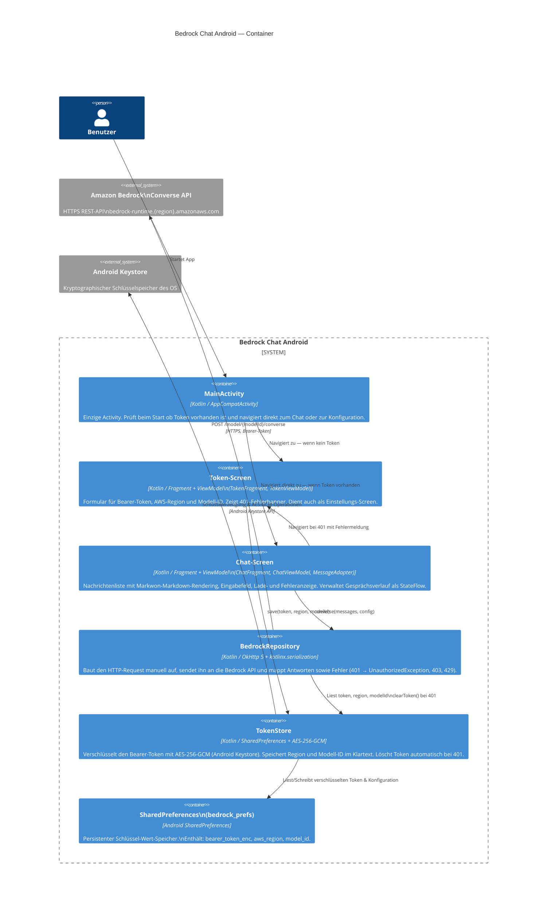

## Level 2 — Container

```mermaid
C4Container
  title Bedrock Chat Android — Container

  Person(user, "Benutzer")

  System_Boundary(app, "Bedrock Chat Android") {

    Container(main, "MainActivity", "Kotlin / AppCompatActivity", "Einzige Activity. Prüft beim Start ob Token vorhanden ist und navigiert direkt zum Chat oder zur Konfiguration.")

    Container(tokenui, "Token-Screen", "Kotlin / Fragment + ViewModel\n(TokenFragment, TokenViewModel)", "Formular für Bearer-Token, AWS-Region und Modell-ID. Zeigt 401-Fehlerbanner. Dient auch als Einstellungs-Screen.")

    Container(chatui, "Chat-Screen", "Kotlin / Fragment + ViewModel\n(ChatFragment, ChatViewModel, MessageAdapter)", "Nachrichtenliste mit Markwon-Markdown-Rendering, Eingabefeld, Lade- und Fehleranzeige. Verwaltet Gesprächsverlauf als StateFlow.")

    Container(repo, "BedrockRepository", "Kotlin / OkHttp 5 + kotlinx.serialization", "Baut den HTTP-Request manuell auf, sendet ihn an die Bedrock API und mappt Antworten sowie Fehler (401 → UnauthorizedException, 403, 429).")

    Container(store, "TokenStore", "Kotlin / SharedPreferences + AES-256-GCM", "Verschlüsselt den Bearer-Token mit AES-256-GCM (Android Keystore). Speichert Region und Modell-ID im Klartext. Löscht Token automatisch bei 401.")

    Container(prefs, "SharedPreferences\n(bedrock_prefs)", "Android SharedPreferences", "Persistenter Schlüssel-Wert-Speicher.\nEnthält: bearer_token_enc, aws_region, model_id.")
  }

  System_Ext(bedrock, "Amazon Bedrock\nConverse API", "HTTPS REST-API\nbedrock-runtime.{region}.amazonaws.com")
  System_Ext(keystore, "Android Keystore", "Kryptographischer Schlüsselspeicher des OS")

  Rel(user, main, "Startet App")
  Rel(main, tokenui, "Navigiert zu — wenn kein Token")
  Rel(main, chatui, "Navigiert direkt zu — wenn Token vorhanden")
  Rel(tokenui, store, "save(token, region, modelId)")
  Rel(chatui, repo, "converse(messages, config)")
  Rel(chatui, tokenui, "Navigiert bei 401 mit Fehlermeldung")
  Rel(repo, store, "Liest token, region, modelId\nclearToken() bei 401")
  Rel(repo, bedrock, "POST /model/{modelId}/converse", "HTTPS, Bearer-Token")
  Rel(store, prefs, "Liest/Schreibt verschlüsselten Token & Konfiguration")
  Rel(store, keystore, "Schlüsselerzeugung & AES-GCM-Operationen", "Android Keystore API")
```
