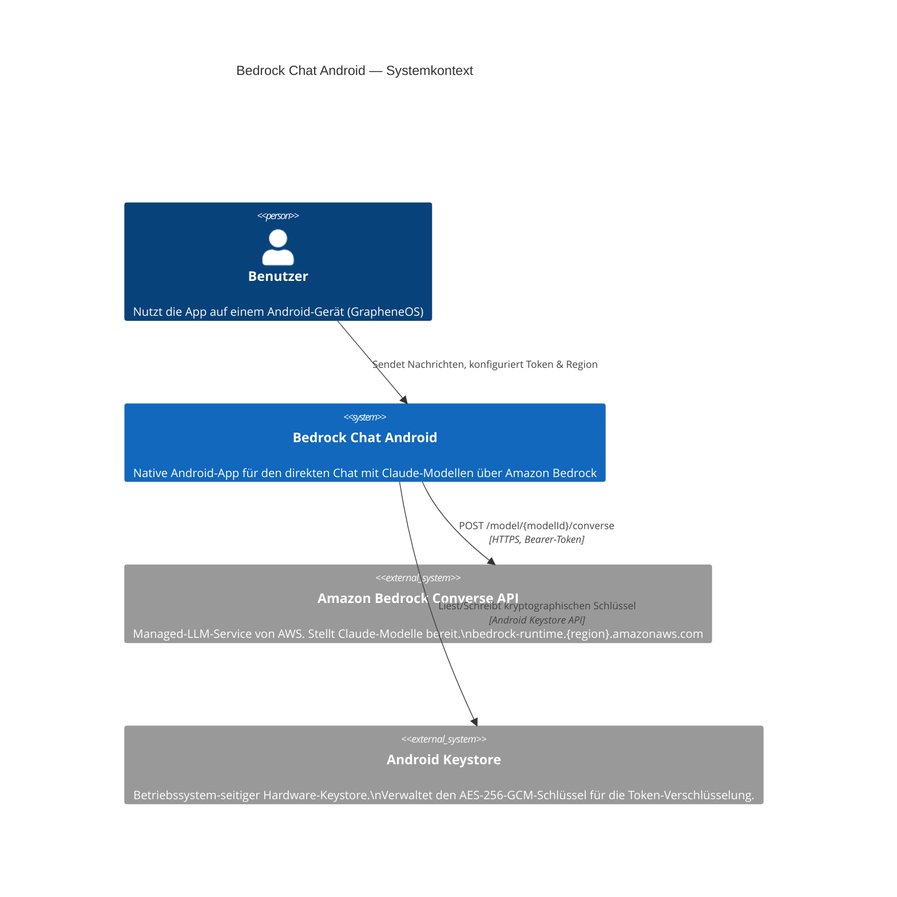

# C4-Architekturdiagramme — Bedrock Chat Android

## Level 1 — Systemkontext

```mermaid
C4Context
  title Bedrock Chat Android — Systemkontext

  Person(user, "Benutzer", "Nutzt die App auf einem Android-Gerät (GrapheneOS)")

  System(app, "Bedrock Chat Android", "Native Android-App für den direkten Chat mit Claude-Modellen über Amazon Bedrock")

  System_Ext(bedrock, "Amazon Bedrock Converse API", "Managed-LLM-Service von AWS. Stellt Claude-Modelle bereit.\nbedrock-runtime.{region}.amazonaws.com")

  System_Ext(keystore, "Android Keystore", "Betriebssystem-seitiger Hardware-Keystore.\nVerwaltet den AES-256-GCM-Schlüssel für die Token-Verschlüsselung.")

  Rel(user, app, "Sendet Nachrichten, konfiguriert Token & Region")
  Rel(app, bedrock, "POST /model/{modelId}/converse", "HTTPS, Bearer-Token")
  Rel(app, keystore, "Liest/Schreibt kryptographischen Schlüssel", "Android Keystore API")
```

---

